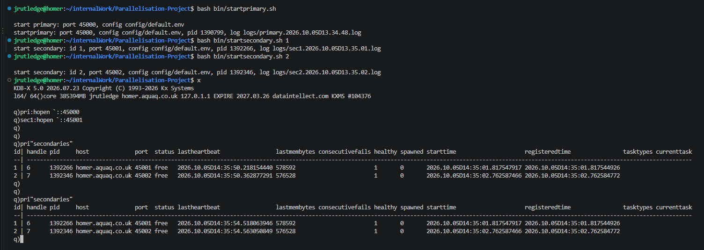

# Parallelisation-Project
Build a pure q parallelisation framework with a master proc that can spin up secondary procs to complete tasks

## Primary 
This is the main process which will manage secondaries and tasks

### how to start
Go to the directory and start this will run the default config and start on port `45000`

```bash
cd /home/jrutledge/internalWork/Parallelisation-Project
bash bin/startprimary.sh
```

### Secondaries
These will either be ran as part of the intial start up or the primary will spin up more as needed. They will take the port number `PRIMARY_PORT` + `id` so `secondary 1` would have a port of `45001` and so on.

### how to start
To bring up 2 secondaries run the below
```bash
cd /home/jrutledge/internalWork/Parallelisation-Project
bash bin/startsecondary.sh 1
bash bin/startsecondary.sh 2
```

## Testing
We will use the qspec testing framework here, i have copied it into the project directly

### how to run tests
From the project top level dir, you run the below commands
```bash
tests/run.sh tests/unit                     # a whole folder
tests/run.sh tests/unit/primary.q           # one file
```

Example run
```bash
jrutledge@homer:~/internalWork/Parallelisation-Project$ tests/run.sh tests/unit/primary.q 
.

For 1 specifications, 1 expectations were run.
1 passed, 0 failed.  0 errors.
jrutledge@homer:~/internalWork/Parallelisation-Project$ 
```


# my notes ignroe in any PR reviews till the end

```
jrutledge@homer:~/internalWork/Parallelisation-Project$ bash bin/startprimary.sh

start primary: port 45000, config config/default.env
startprimary: port 45000, config config/default.env, pid 1362094, log logs/primary.2026.10.05D13.29.29.log

jrutledge@homer:~/internalWork/Parallelisation-Project$ bash bin/startsecondary.sh 1
start secondary: id 1, port 45001, config config/default.env, pid 1362384, log logs/sec1.2026.10.05D13.29.34.log

jrutledge@homer:~/internalWork/Parallelisation-Project$ bash bin/startsecondary.sh 2
start secondary: id 2, port 45002, config config/default.env, pid 1362708, log logs/sec2.2026.10.05D13.29.37.log
jrutledge@homer:~/internalWork/Parallelisation-Project$ 
```

### q stuff
```q
pri:hopen `::45000

sec1:hopen `::45001
```
### create an images folder or stick them all under docs/images and look at referncing them better
